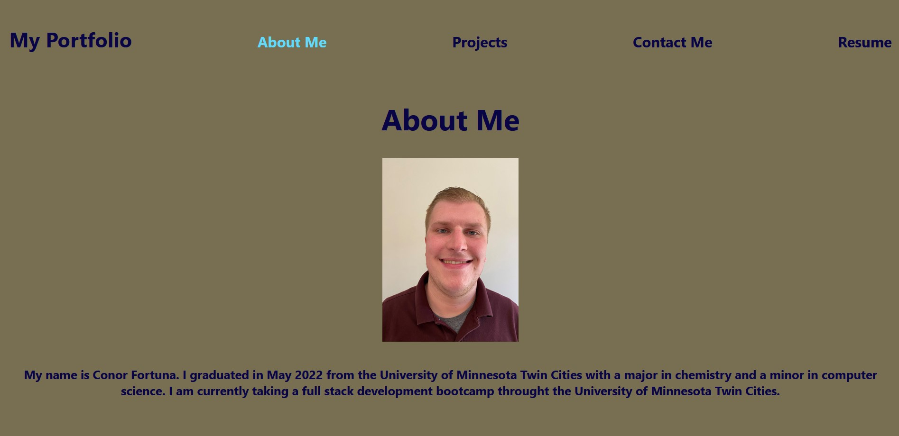

# React_Portfolio

## Description

The goal of this project was to create a personal portfolio site using react. The created site acts as a portfolio which contains information about me, my projects, my contacts, and my resume. During this project I learned how to work with React and refresehd my HTML and CSS skills.

## Installation

N/A

## Usage

The created site acts as a personal portfolio, containing information about me and my work. There are four separate section on the site, "About Me, "Projects", "Contact Me", and "Resume". About Me contains a photo of myself and a breif description of me. Projects contains six projects that I have worked on, which when hovered over will display the project's name and a separate image that may be clicked on to access the project's GitHub repo. Contact Me lists my contact details and a non-functional contact form that can be filled out. Resume contains a breif description of my skills and a download link for my resume.

## Credits

N/A

## License

Please refer to the license in the repo

## Links and Images
Github Repo URL: https://github.com/fortu038/React_Portfolio

Active Site URL: https://fortu038.github.io/React_Portfolio/

